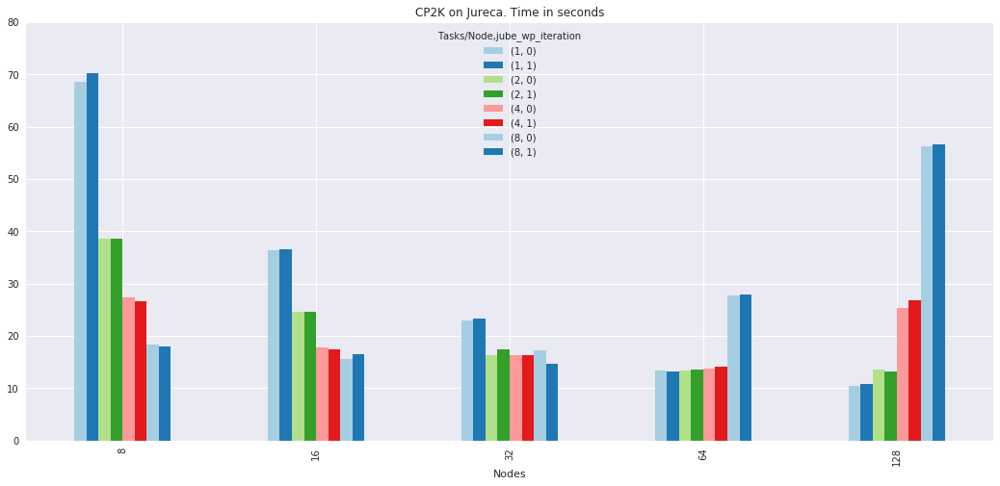

# Introduction

Test [@doi:10.1177/109434208900300302], has become a popular shaping route for all kinds of macroporous materials. The process is based on the segregation of matter (particles or solute) by growing crystals in a suspension or solution (Fig. 1). After complete solidification, the solvent crystals are removed by sublimation. The porosity obtained is thus an almost direct replica of the solvent crystals.

